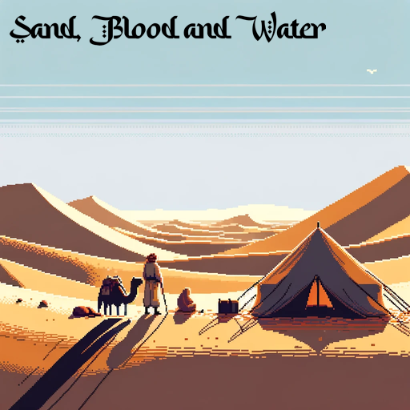

## Sand, Blood and Water

Living, trading, fighting and dying in the desert. Desert based RPG/life sim written in Rust using the Bevy game engine.

Gameplay inspired by Crusader Kings, The Guild 2, Kenshi, Factorio and numerous economy/management sims. 

Setting inspired by pre-Islamic North African and Middle-Easter nomadic tribes and Frank Herbert's Dune, particularly the Fremen and the sanctity + scarcity of their water.

### Features
* Define how you enter this world: a lone nomad seeking company, fortune or just another day without dying of thirst. The child of a wealthy tribal leader set to inherit power. A slave working on a hemp plantation seeking freedom and a new start.
* Explore the harsh, desert landscape looking for somewhere with fresh water; somewhere to sleep; somewhere to settle; somewhere to exploit or somewhere to thrive. Interact, co-operate or compete with other nomads, tribes, villages or even warlords.
* Hone your skills in scavenging, farming, crafting, fighting, healing or command. Build your reputation and carve out your niche under these oppressive conditions.
* Start a family, inspire your children and designate an heir to take-over your legacy as your body begins to wither into the sand or your blood is spilled by the covetous.
* Live off, steal from or help define the network of desert trade routes that move goods into and out of the desert.
* Be subject to, influence or dictate the behaviour of those around you. Use a combination of fear and respect to improve your standing amongst your peers.

### To Run
* You'll require Rust, as you'd imagine. I'm running version 1.76.0-nightly at time of writing.
* `cargo build`
* `cargo run`

### File Structuring
I'm trying to keep consistent with bundling entity definitions on a directory to directory basis.

* `component.rs` files should only contain component or enum definitions.
* `entity.rs` files should only contain functions that yield component bundles require to spawn a given entity.
* `plugin.rs` files should only contain plugin definitions and their `Plugin` impl.
* `system.rs` files should only contain system functions.
* `utils.rs` files should contain any other function that may be used by any of the other file types that don't fit any of the descriptions listed above.

This is WIP, and I'll see if this structure hinders or helps me, but currently find it an appropriate way to segregate file responsibilities.

### Milestones
* Version 0.1.0 - Learning and Setup
  * Set-up application infrastructure and defined file structuring.
  * Created camera
  * Created player - introduced sprite and implemented basic movement system.
  * Created map - introduced map config, parse and sprite render.
* Version 0.2.0 - Interactions and Collisions
  * TBD!